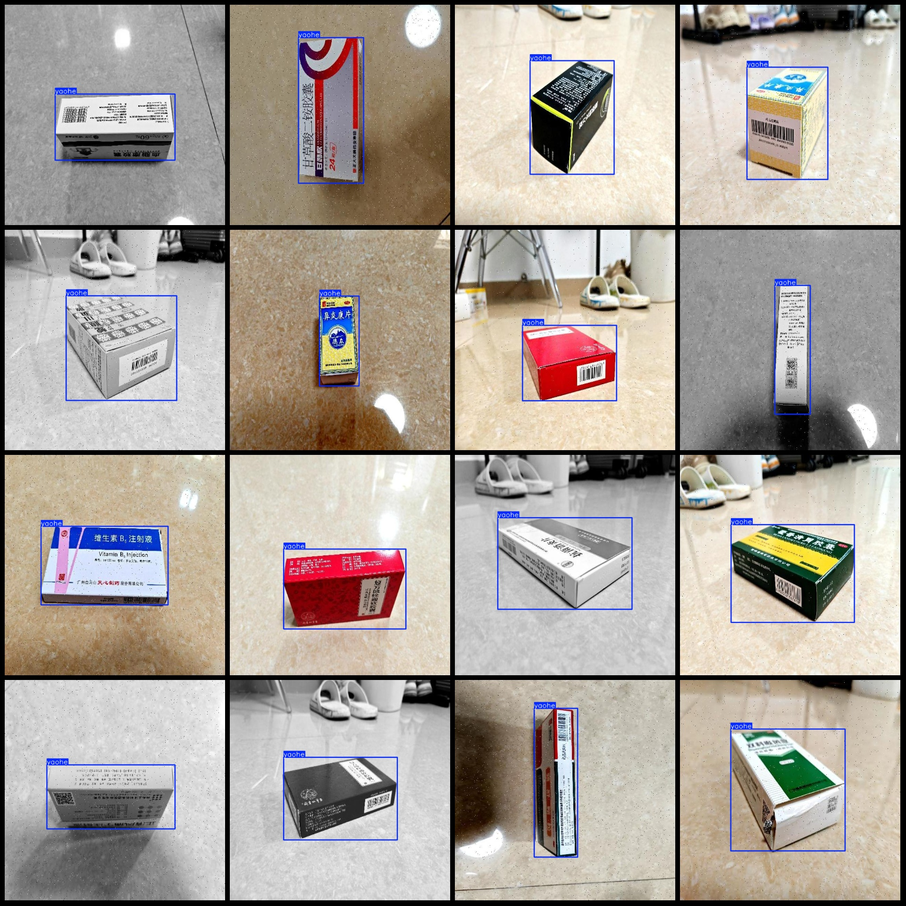
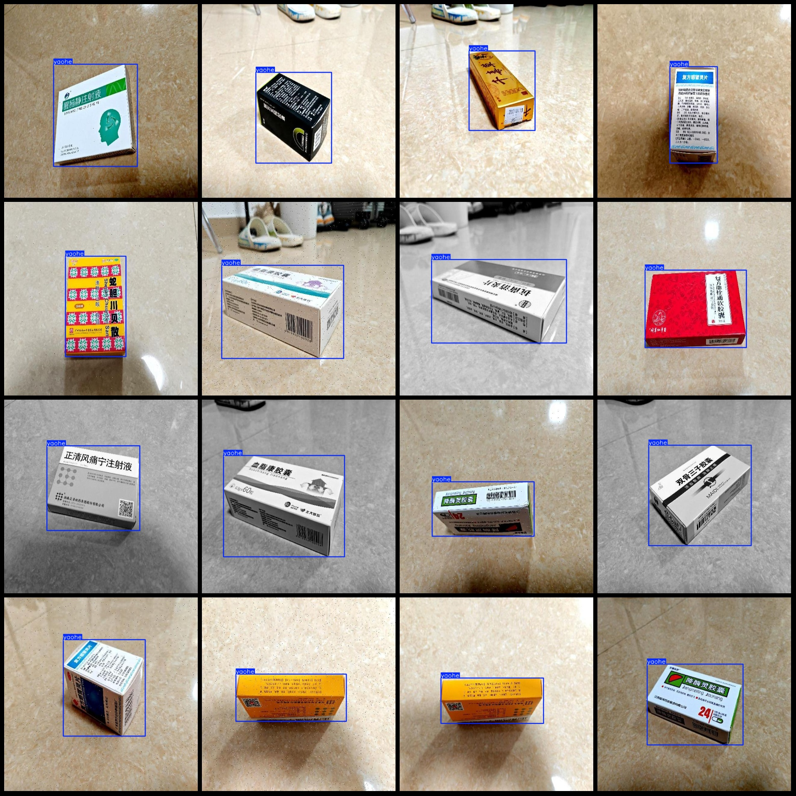

# Smart Medical Medicine Box Pharmaceutical Packaging Box Detection Dataset VOC+YOLO Format with 3000 Images in One Category

Please note that the dataset contains enhanced images, many of which are taken from different angles of a medicine box. All the images feature one medicine box. The dataset has been clearly explained,
 and no refunds will be issued for reasons such as excessive duplicate images, low resolution, multiple medicine boxes, or lack of diverse scenarios.

The dataset format: Pascal VOC format + YOLO format (excluding the split path's txt file, only containing jpg images along with corresponding VOC format xml files and YOLO format txt files).

Number of images (jpg file count): 3000
Number of annotations (xml file count): 3000
Number of annotations (txt file count): 3000
Number of annotation categories: 1
Annotation category name: "yaohe"
Number of bounding boxes per category: 3000
Total number of bounding boxes: 3000
Number of images per category: 3000
Image resolution: 640x640
Annotation tool used: labelImg
Annotation rules: draw bounding boxes for each category
Important note: The dataset does not contain training, validation, and test splits; you must manually split it.
Special declaration: This dataset does not guarantee the accuracy of models trained on it or the weights.
Image preview:
Annotation example:

## Image

Here is a pay link on Stripe ( https://buy.stripe.com/3cs8yP7sY87d0vu9AB ). Please contact me lonlonago@foxmail.com after funding $89, and I will send you a complete data files , thank you!

